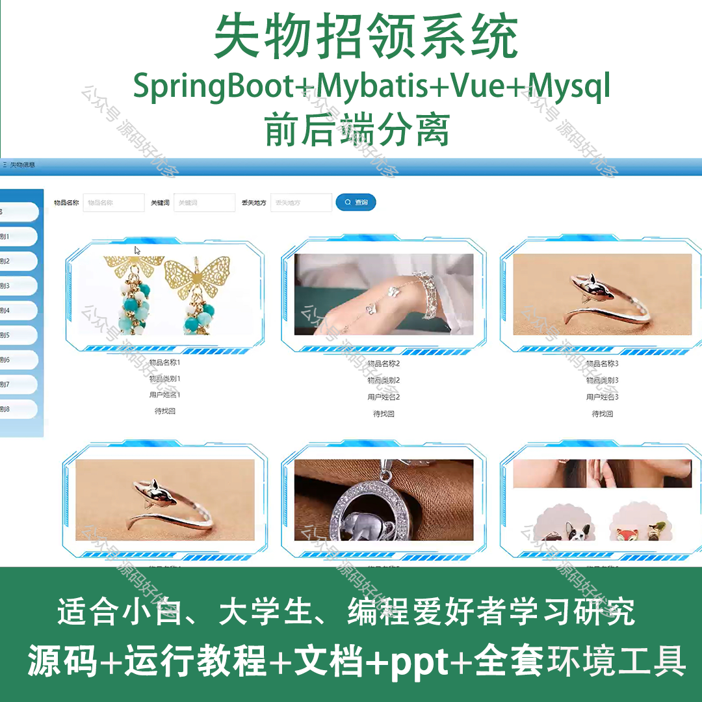
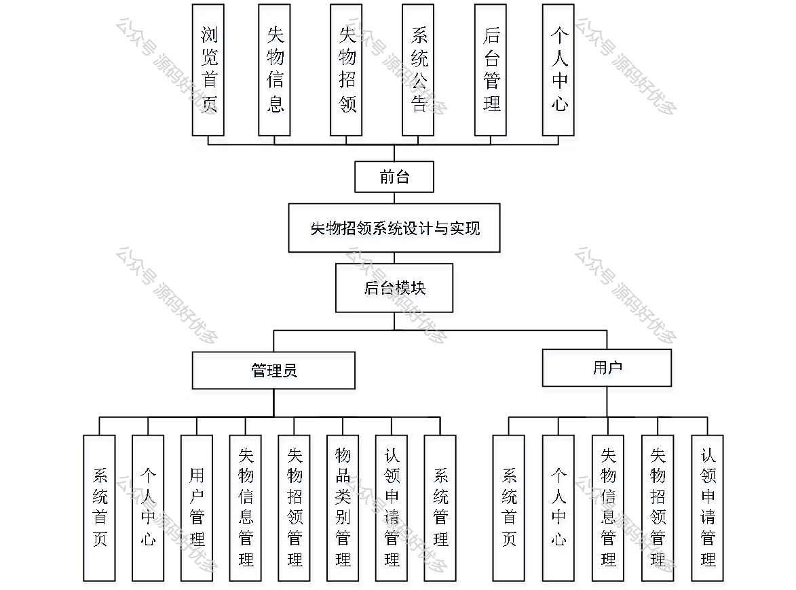
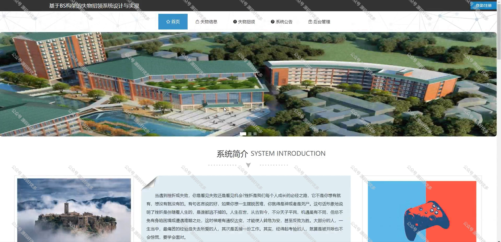
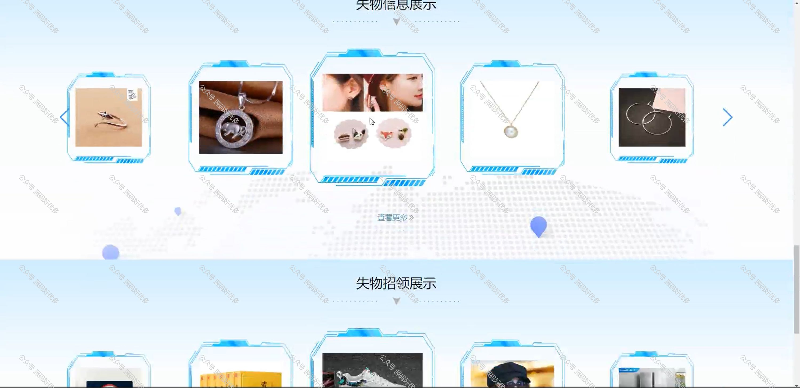
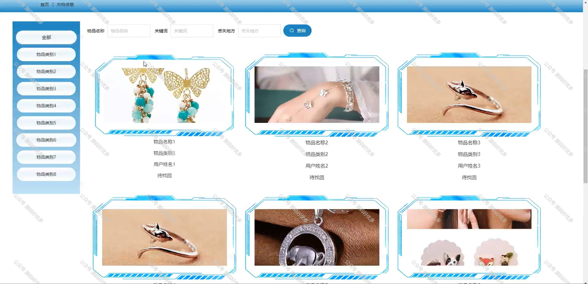
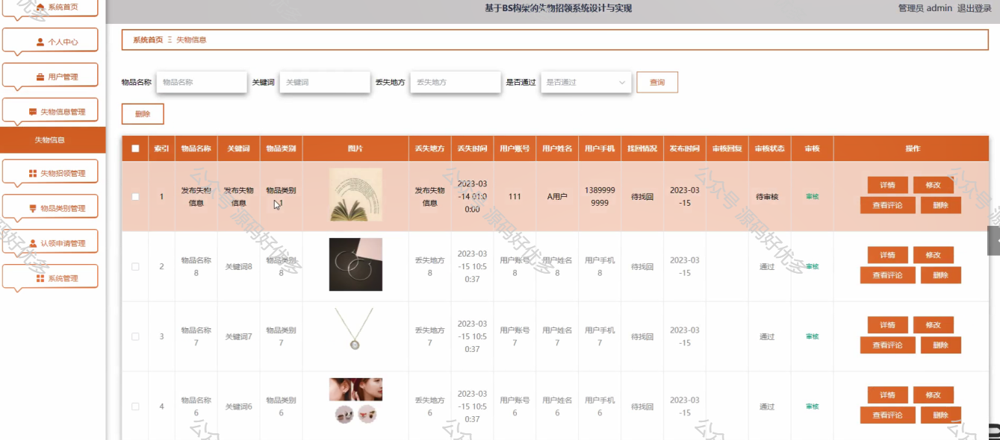
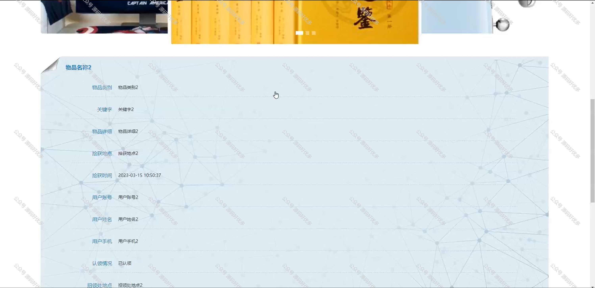
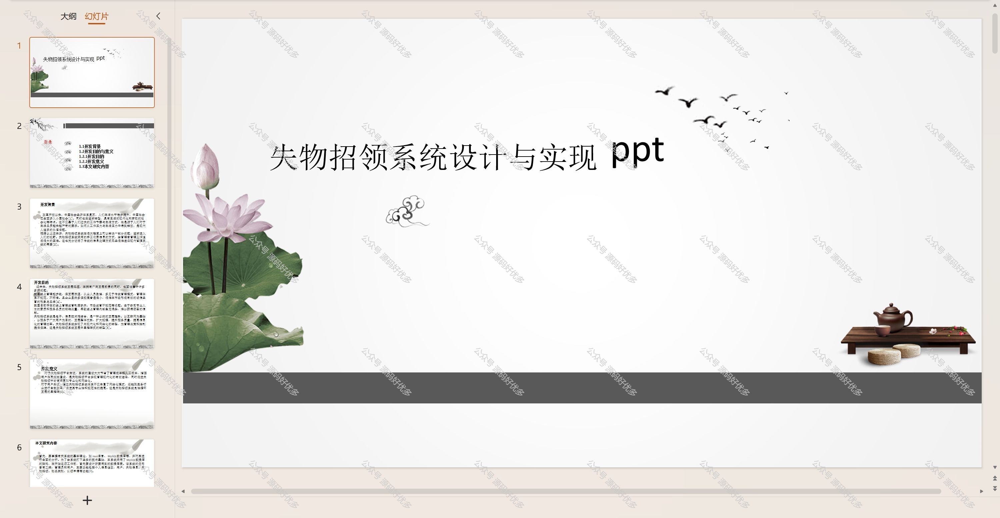
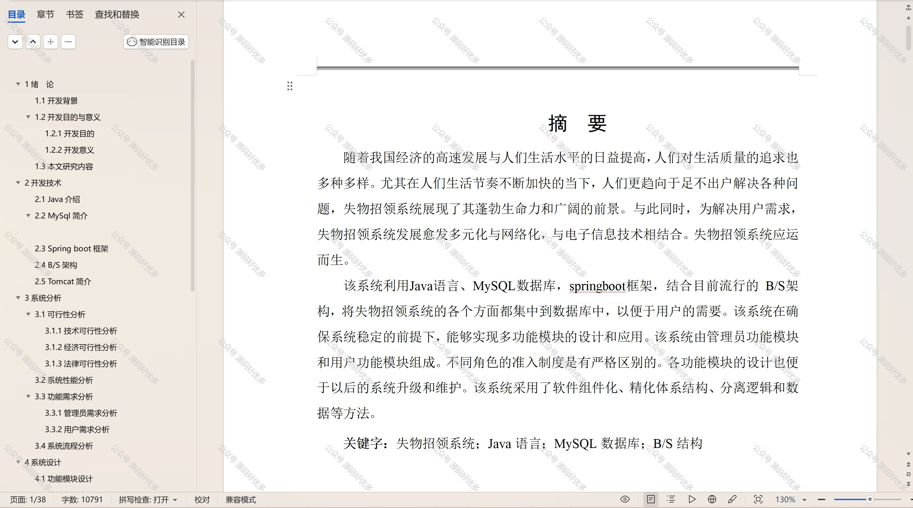

 
## 查看主页获取源码

### 一、作品包含

源码+数据库+设计文档万字+PPT+全套环境和工具资源+部署教程

### 二、项目技术

前端技术：Html、Css、Js、Vue、Element-ui

数据库：MySQL

后端技术：Java、Spring Boot、MyBatis

  

### 三、运行环境

开发工具：IDEA/eclipse

数据库：MySQL5.7

数据库管理工具：Navicat10以上版本

环境配置软件： JDK1.8+Maven3.6.3

前端Nodejs：14

### 四、项目介绍
项目编号：springbootA202

在现代快节奏的生活中，失物招领系统作为一种便捷的服务平台，旨在帮助人们找回遗失的物品，弘扬拾金不昧的优良传统。该系统通过线上发布失物信息等功能，极大地提高了失物找回的效率，为广大市民提供了贴心的帮助，同时也促进了社会诚信体系的构建。

前台用户功能：浏览首页、失物信息、失物招领、系统公告、后台管理和个人中心。

后台分为管理员和用户
管理员的功能：系统首页、个人中心、用户管理、失物信息管理、失物招领管理、物品类别管理、认领申请管理、系统管理。
用户的功能：系统首页、个人中心、失物信息管理、失物招领管理、认领申请管理。

### 五、运行截图

  
